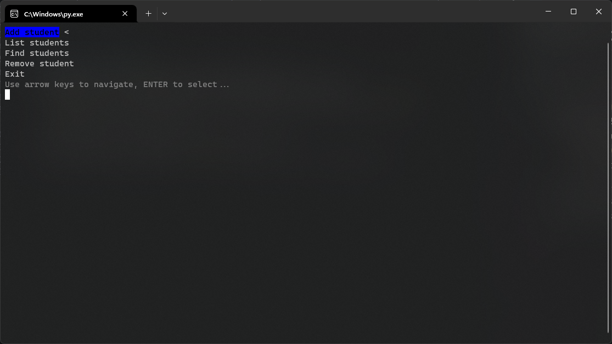

# Programik gdzie można dodawać studentów i tam usuwać je też da się

## Instrukcja użytkowania
1. Uruchomić plik `main.py` za pomocą Python 3.12.4
1. Wybrać tryb pracy UI
	- P.S. Nie miałem czasu na przerobienie całego kodu na użycie biblioteki curses
1. Wprowadzić klucz do szyfru cezara poraz pierwszy
	- Jest używany do szyfrowania bazy danych
1. Posługiwać się strzałkami (Interactive mode) lub cyferkami (Non-interactive mode) i `Enter` żeby zaznaczyć opcję w menu
